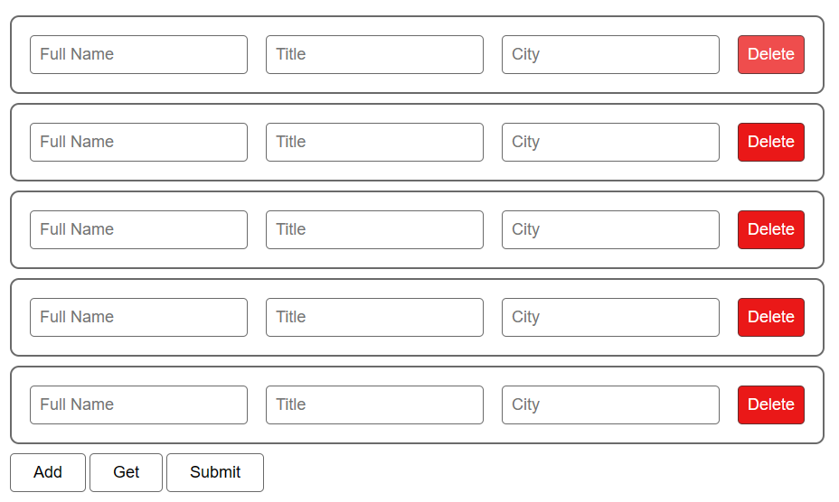

# Form group repeater


## Authors

- [@nazmulhasan1010](https://www.github.com/nazmulhasan1010)


## Features

- Return Form Submit/Javascript Data Array Object
- Custom/Default css use
- Fresh mode
- Easy to use


## Installation
``` jquery ``` Required
```bash
<script src="https://code.jquery.com/jquery-3.6.3.min.js"integrity="sha256-pvPw+upLPUjgMXY0G+8O0xUf+/Im1MZjXxxgOcBQBXU=" crossorigin="anonymous"></script>
<script src="form-group-reapeter.min.js"></script>
```
``` HTML ``` File like ...
```
<div class="mainContainer">
    <form action="" method="post">
        <div data-formGroup="formGroup">
            <div class="mainCard" data-groupItem="group-item" groupName="employs">
                <input class="inputField" type="text" placeholder="Full Name" data-name="name"/>
                <input class="inputField" type="text" placeholder="Title" data-name="title"/>
                <input class="inputField" type="text" placeholder="City" data-name="city"/>
            </div>
        </div>
        <button type="button" class="btn " data-addButton="add-button">Add</button>
        <button type="button" class="btn  getData">Get</button>
        <button type="submit" class="btn ">Submit</button>
    </form>
</div>
```
Then use this plugin with ``` jquery ```
```javascript
$('[data-formGroup="formGroup"]').formGroup();
```
To use custom ```css``` 
```javascript
$('[data-formGroup="formGroup"]').formGroup({
    style: 'custom',
    css: {
        'background-color': '#fff',
        'height': '30px',
        'margin': '5px',
    }
});
```
To get data  ``` Array ``` 
```javascript
$('[data-formGroup="formGroup"]').formGroup({
    dataType: 'data-array'
});

// to get data call the getData function
$('.getData').click(function () {
    let data = getData($('[data-formGroup="formGroup"]'));
    console.log(data)
});
## Screenshots




## Badges

Add badges from somewhere like: [shields.io](https://shields.io/)

[](https://choosealicense.com/licenses/mit/)
[](https://opensource.org/licenses/)
[](http://www.gnu.org/licenses/agpl-3.0)

